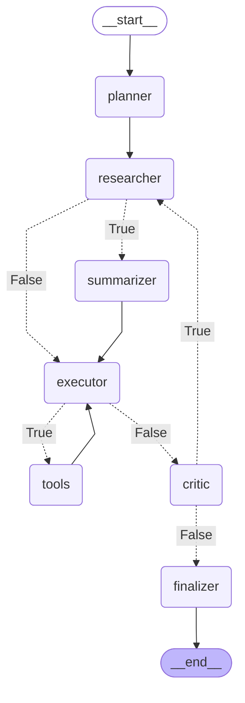

# SpotifAI

Generador de playlists de Spotify con IA. Interactúa en modo chat para buscar canciones, crear y gestionar playlists usando la API de Spotify y un modelo de lenguaje (OpenAI u otros compatibles con LangChain).

> 😒 Se ha abandonado el desarrollo del agente debido al cambio en las políticas de Spotify en cuanto al acceso a su Web API desde cuentas gratuitas. 

> Sin embargo, es posible aprovechar el módulo `src/deepagent` para implementar otro tipo de agentes inteligentes.

## Características

- Búsqueda de canciones y metadatos básicos.
- Creación de playlists (públicas/privadas) y añadido/eliminado de temas.
- Listado de tus playlists y de las pistas de una playlist concreta.
- Reordenación de items en una playlist.
- Flujo de autenticación con Spotify usando PKCE y callback local seguro (HTTPS).

## Requisitos

- Python 3.12 o superior.
- Cuenta de Spotify.
- Clave API del proveedor LLM (por ejemplo, OpenAI) si usas modelos en la nube.

## Instalación

Instala directamente desde GitHub:

```bash
pip install "spotifai @ git+https://github.com/falkenslab/spotifai.git@main"
```

Alternativa con `uv`:

```bash
uv pip install "spotifai @ git+https://github.com/falkenslab/spotifai.git@main"
# ejecutar el CLI (si tu shell no tiene el path del venv activo)
uv run spotifai
```

## Configuración

Crea un archivo `.env` en la raíz del proyecto (se carga automáticamente con `python-dotenv`) con tus credenciales y configuración del modelo LLM:

```env
# LLM API
OPENAI_API_KEY=sk-...            # tu clave si usas OpenAI
DEFAULT_MODEL_PROVIDER=openai     # openai | ollama | (otros compatibles con LangChain)
DEFAULT_MODEL_NAME=gpt-4o-mini    # por ejemplo: gpt-4o | gpt-4o-mini | llama3
```

Notas sobre Spotify:

- El proyecto usa OAuth con PKCE y un callback local seguro: `https://127.0.0.1:8888/callback`.
- En el primer uso se abre el navegador para autorizar la app. Se guarda caché en `~/.spotifai/.cache`.
- Se generan certificados autofirmados en `~/.spotifai`.
- El `client_id` está preconfigurado en el código para simplificar el arranque. Si prefieres tu propia app de Spotify:
  - Crea una app en https://developer.spotify.com/dashboard
  - Registra la URI de redirección: `https://127.0.0.1:8888/callback`
  - Sustituye `SPOTIFY_CLIENT_ID` en `src/spotify/__init__.py` por tu Client ID.

## Uso

Lanza el asistente en modo interactivo:

```bash
spotifai
# o
python -m spotifai
```

Primera ejecución:

- Se abrirá una pestaña del navegador para autorizar el acceso a tu cuenta de Spotify.
- Tras aceptar, verás en consola el mensaje de autenticación completada y el nombre de tu usuario de Spotify.

Ejemplos de prompts en el chat:

- "Búscame canciones de rock energético alrededor de 150 BPM."
- "Crea una playlist privada llamada 'Mañanas Chill' con 20 temas de lo-fi."
- "Añade estas canciones a la playlist 'Running Mix': <pega URLs o URIs de Spotify>"
- "Lista las pistas de la playlist 'Descubrimiento semanal'."
- "Mueve los 3 primeros temas al final de la playlist 'Fiesta'."

Las herramientas disponibles para el agente incluyen: búsqueda de canciones, creación de playlist, añadir/eliminar temas, listar playlists/pistas y reordenar elementos.

## Solución de problemas

- No se abre el navegador: copia y pega manualmente la URL de autorización mostrada en consola en tu navegador.
- Error de certificado/HTTPS en el callback:
  - Verifica que `openssl` esté instalado y accesible en tu `PATH`.
  - Elimina `~/.spotifai/cert.pem` y `~/.spotifai/key.pem` y vuelve a lanzar para regenerarlos.
- Puerto `8888` ocupado: cambia `SPOTIPY_REDIRECT_PORT` en `src/spotifai/__init__.py`.
- Permisos insuficientes: asegúrate de haber aceptado los permisos solicitados (scopes) al autorizar la app.

## Desarrollo y contribución

1) Instala extras de desarrollo con `uv`:

```bash
uv pip install -e .[dev]
```

2) Estilo y formato:

```bash
uv run black src
uv run isort src
```

3) Tests:

```bash
uv run pytest -q
```

4) Flujo de contribución:

- Haz fork del repositorio.
- Crea una rama de feature/fix: `git checkout -b feat/mi-cambio`.
- Realiza cambios acotados y añade pruebas si aplica.
- Pasa formato y tests con `uv run`.
- Abre un Pull Request explicando el contexto y las decisiones.

## Grafo del agente



Made with ❤️ by @falkenslab_team